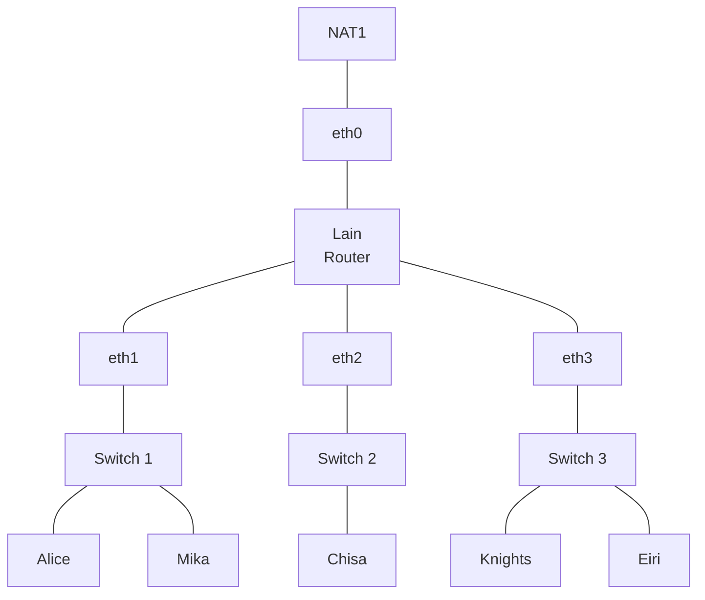
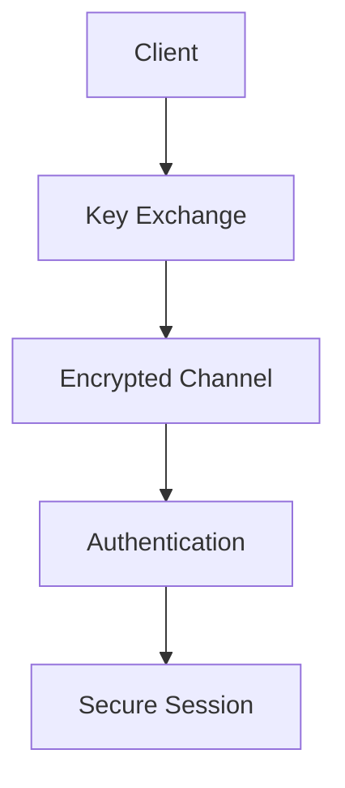

# Praktikum Jaringan Komputer 2026

## Serial Experiments LAIN — Modul 1

Repository ini berisi laporan Praktikum Jaringan Komputer 2026 dengan skenario **The Wired**. Praktikum dilakukan menggunakan GNS3 dan Wireshark untuk mempelajari konfigurasi jaringan, routing, NAT, berbagai layanan jaringan, serta analisis packet capture.

---

## Identitas Kelompok K-51

| No. | Nama                         |     NRP    |
| :-: | ---------------------------- | :--------: |
|  1  | Arrumanta Ekna Luhkinasih | 5027251044 |
|  2  | Muhammad Hugo Rayandra E   | 5027251076 |

---

## Daftar Isi

* [1. Informasi Praktikum](#1-informasi-praktikum)
* [2. Tujuan Praktikum](#2-tujuan-praktikum)
* [3. Topologi Jaringan](#3-topologi-jaringan)
* [4. Skema IP Address](#4-skema-ip-address)
* [5. Konfigurasi Router Lain](#5-konfigurasi-router-lain)
* [6. Konfigurasi Client](#6-konfigurasi-client)
* [7. Nomor 5 — Persistence & Script Verifikasi](#7-nomor-5--persistence--script-verifikasi)
* [8. Nomor 6 — DNS & ICMP Traffic](#8-nomor-6--dns--icmp-traffic)
* [9. Nomor 7 — Konfigurasi FTP](#9-nomor-7--konfigurasi-ftp)
* [10. Nomor 8 — FTP Knights](#10-nomor-8--ftp-knights)
* [11. Nomor 9 — FTP Mika](#11-nomor-9--ftp-mika)
* [12. Nomor 10 — ICMP Traffic](#12-nomor-10--icmp-traffic)
* [13. Nomor 11 — Telnet](#13-nomor-11--telnet)
* [14. Nomor 12 — Nmap](#14-nomor-12--nmap)
* [15. Nomor 13 — SSH](#15-nomor-13--ssh)
* [16. Nomor 14 — HTTP Brute Force](#16-nomor-14--http-brute-force)
* [17. Nomor 15 — USB HID](#17-nomor-15--usb-hid)
* [18. Nomor 16 — FTP Malware](#18-nomor-16--ftp-malware)
* [19. Nomor 17 — Malware Download](#19-nomor-17--malware-download)
* [20. Nomor 18 — SMB File Transfer](#20-nomor-18--smb-file-transfer)
* [21. Nomor 19 — SMTP Threat](#21-nomor-19--smtp-threat)
* [22. Nomor 20 — TLS Decryption](#22-nomor-20--tls-decryption)
* [23. Ringkasan Hasil Praktikum](#23-ringkasan-hasil-praktikum)
* [24. Kesimpulan](#24-kesimpulan)
* [25. Dokumentasi Foto](#25-dokumentasi-foto)
* [26. Catatan](#26-catatan)
* [Author](#author)

---

# 1. Informasi Praktikum

| Keterangan  | Detail                           |
| ----------- | -------------------------------- |
| Mata Kuliah | Praktikum Jaringan Komputer      |
| Modul       | Modul 1 — Wireshark & Setup GNS3 |
| Skenario    | The Wired                        |
| Tahun       | 2026                             |

### Tools yang Digunakan

* GNS3
* Wireshark
* Alpine Linux
* BusyBox
* iptables
* vsftpd
* lftp
* Telnet
* SSH
* Nmap
* Netcat
* GitHub

---

# 2. Tujuan Praktikum

Praktikum ini bertujuan untuk memahami konsep jaringan komputer secara langsung melalui simulasi menggunakan GNS3.

Tujuan praktikum meliputi:

1. Membuat topologi jaringan menggunakan GNS3.
2. Melakukan konfigurasi interface Linux.
3. Melakukan konfigurasi IP address.
4. Memahami subnetting dan default gateway.
5. Melakukan routing antar-subnet.
6. Mengaktifkan IPv4 forwarding.
7. Mengimplementasikan NAT menggunakan iptables.
8. Membuat konfigurasi yang dapat diverifikasi setelah restart.
9. Membuat script otomatisasi.
10. Menghasilkan traffic DNS dan ICMP.
11. Menganalisis traffic menggunakan Wireshark.
12. Membuat dan menguji FTP server.
13. Menganalisis komunikasi Telnet.
14. Melakukan scanning service menggunakan Nmap.
15. Memahami keamanan SSH.
16. Menganalisis HTTP, USB HID, FTP, SMB, SMTP, dan TLS traffic.

---

# 3. Topologi Jaringan

Topologi yang digunakan terdiri dari satu router Linux bernama **Lain**, tiga switch, lima client, serta satu NAT.



Router **Lain** digunakan sebagai gateway untuk seluruh subnet internal.

---

# 4. Skema IP Address

## 4.1 Pembagian Network

| Network        | Gateway     | Client        |
| -------------- | ----------- | ------------- |
| `10.89.1.0/24` | `10.89.1.1` | Alice, Mika   |
| `10.89.2.0/24` | `10.89.2.1` | Chisa         |
| `10.89.3.0/24` | `10.89.3.1` | Knights, Eiri |

## 4.2 Detail IP Address

| Node    | Interface | IP Address      | Gateway     |
| ------- | --------- | --------------- | ----------- |
| Lain    | eth0      | DHCP            | NAT1        |
| Lain    | eth1      | `10.89.1.1/24`  | —           |
| Lain    | eth2      | `10.89.2.1/24`  | —           |
| Lain    | eth3      | `10.89.3.1/24`  | —           |
| Alice   | eth0      | `10.89.1.10/24` | `10.89.1.1` |
| Mika    | eth0      | `10.89.1.11/24` | `10.89.1.1` |
| Chisa   | eth0      | `10.89.2.10/24` | `10.89.2.1` |
| Knights | eth0      | `10.89.3.10/24` | `10.89.3.1` |
| Eiri    | eth0      | `10.89.3.11/24` | `10.89.3.1` |

---

# 5. Konfigurasi Router Lain

Router Lain menggunakan Alpine Linux dan memiliki empat interface.

| Interface | Koneksi |
| --------- | ------- |
| eth0      | NAT1    |
| eth1      | Switch1 |
| eth2      | Switch2 |
| eth3      | Switch3 |

## 5.1 Mengaktifkan Interface

```bash
ip link set eth0 up
ip link set eth1 up
ip link set eth2 up
ip link set eth3 up
```

## 5.2 Mendapatkan IP dari NAT

```bash
udhcpc -i eth0
```

Memeriksa IP address:

```bash
ip -br a
```

## 5.3 Konfigurasi IP Internal

```bash
ip addr add 10.89.1.1/24 dev eth1
ip addr add 10.89.2.1/24 dev eth2
ip addr add 10.89.3.1/24 dev eth3
```

Memeriksa routing:

```bash
ip route
```

## 5.4 Mengaktifkan IPv4 Forwarding

```bash
sysctl -w net.ipv4.ip_forward=1
```

Verifikasi:

```bash
cat /proc/sys/net/ipv4/ip_forward
```

Output yang diharapkan:

```text
1
```

## 5.5 Konfigurasi NAT

```bash
iptables -t nat -A POSTROUTING -o eth0 -j MASQUERADE
```

Memeriksa tabel NAT:

```bash
iptables -t nat -L -v -n
```

## 5.6 Konfigurasi Forwarding Internet

Mengizinkan traffic dari jaringan internal menuju internet:

```bash
iptables -A FORWARD -i eth1 -o eth0 -j ACCEPT
iptables -A FORWARD -i eth2 -o eth0 -j ACCEPT
iptables -A FORWARD -i eth3 -o eth0 -j ACCEPT
```

Mengizinkan response dari internet menuju jaringan internal:

```bash
iptables -A FORWARD -i eth0 -o eth1 -m conntrack --ctstate ESTABLISHED,RELATED -j ACCEPT
iptables -A FORWARD -i eth0 -o eth2 -m conntrack --ctstate ESTABLISHED,RELATED -j ACCEPT
iptables -A FORWARD -i eth0 -o eth3 -m conntrack --ctstate ESTABLISHED,RELATED -j ACCEPT
```

## 5.7 Forwarding Antar-Subnet

```bash
iptables -A FORWARD -i eth1 -o eth2 -j ACCEPT
iptables -A FORWARD -i eth1 -o eth3 -j ACCEPT

iptables -A FORWARD -i eth2 -o eth1 -j ACCEPT
iptables -A FORWARD -i eth2 -o eth3 -j ACCEPT

iptables -A FORWARD -i eth3 -o eth1 -j ACCEPT
iptables -A FORWARD -i eth3 -o eth2 -j ACCEPT
```

## 5.8 Pengujian Koneksi

```bash
ping -c 3 192.168.122.1
```

---

# 6. Konfigurasi Client

Setiap client dikonfigurasi menggunakan IP address statis sesuai subnet masing-masing.

## 6.1 Alice

```bash
ip addr add 10.89.1.10/24 dev eth0
ip link set eth0 up
ip route add default via 10.89.1.1
echo "nameserver 8.8.8.8" > /etc/resolv.conf
```

Pengujian:

```bash
ping -c 3 10.89.1.1
```

## 6.2 Mika

```bash
ip link set eth0 up
ip addr add 10.89.1.11/24 dev eth0
ip route add default via 10.89.1.1
echo "nameserver 8.8.8.8" > /etc/resolv.conf
```

## 6.3 Chisa

```bash
ip link set eth0 up
ip addr add 10.89.2.10/24 dev eth0
ip route add default via 10.89.2.1
echo "nameserver 8.8.8.8" > /etc/resolv.conf
```

## 6.4 Knights

```bash
ip link set eth0 up
ip addr add 10.89.3.10/24 dev eth0
ip route add default via 10.89.3.1
echo "nameserver 8.8.8.8" > /etc/resolv.conf
```

## 6.5 Eiri

```bash
ip link set eth0 up
ip addr add 10.89.3.11/24 dev eth0
ip route add default via 10.89.3.1
echo "nameserver 8.8.8.8" > /etc/resolv.conf
```

---

# 7. Nomor 5 — Persistence & Script Verifikasi

## Tujuan

Memastikan konfigurasi jaringan dapat diverifikasi setelah node mengalami restart.

## 7.1 Membuat Script

File:

```text
/root/cek_status.sh
```

Isi script:

```bash
#!/bin/sh

echo "===== INTERFACE ====="
ip -br a

echo
echo "===== NAT TABLE ====="
iptables -t nat -L -v -n
```

## 7.2 Memberikan Permission

```bash
chmod +x /root/cek_status.sh
```

## 7.3 Menjalankan Script

```bash
/root/cek_status.sh
```

### Hasil yang Diharapkan

```text
===== INTERFACE =====

[hasil ip -br a]

===== NAT TABLE =====

[hasil iptables -t nat -L -v -n]
```

### Bukti Pengerjaan

* [ ] Screenshot hasil script verifikasi

---

# 8. Nomor 6 — DNS & ICMP Traffic

## Tujuan

Menghasilkan traffic DNS dan ICMP, kemudian menganalisisnya menggunakan Wireshark.

## 8.1 Membuat Script

File:

```text
/root/traffic_protocol7.sh
```

Isi script:

```bash
#!/bin/bash

echo "[*] Generating DNS & ICMP traffic..."
echo

echo "[+] ICMP traffic..."

ping -c 5 8.8.8.8
ping -c 5 1.1.1.1
ping -c 3 its.ac.id

echo

echo "[+] DNS traffic..."

nslookup google.com 8.8.8.8
nslookup its.ac.id 8.8.8.8
nslookup github.com 1.1.1.1

dig @8.8.8.8 example.com A
dig @1.1.1.1 cloudflare.com AAAA

echo

echo "[*] Traffic generation complete."
```

## 8.2 Memberikan Permission

```bash
chmod +x /root/traffic_protocol7.sh
```

## 8.3 Menjalankan Script

```bash
/root/traffic_protocol7.sh
```

## 8.4 Capture Wireshark

Pada node Mika:

1. Klik kanan koneksi Mika.
2. Pilih **Start capture**.
3. Buka Wireshark.
4. Jalankan script traffic.
5. Amati packet yang muncul.

## 8.5 Filter Wireshark

**DNS**

```wireshark
dns
```

**ICMP**

```wireshark
icmp
```

## 8.6 Analisis

DNS digunakan untuk melakukan resolusi nama domain menjadi alamat IP.

Domain yang digunakan:

* `google.com`
* `its.ac.id`
* `github.com`
* `example.com`
* `cloudflare.com`

ICMP digunakan oleh perintah `ping` untuk menguji konektivitas jaringan.

Packet yang dapat diamati:

* Echo Request
* Echo Reply

### Bukti Pengerjaan

* [ ] Screenshot script nomor 6
* [ ] Screenshot Wireshark DNS
* [ ] Screenshot Wireshark ICMP

---

# 9. Nomor 7 — Konfigurasi FTP

## Tujuan

Membuat FTP server menggunakan vsftpd dengan hak akses berbeda untuk setiap user.

## 9.1 Pembagian Hak Akses

| User  | Password | Hak Akses                |
| ----- | -------- | ------------------------ |
| alice | `123`    | Dapat melakukan transfer |
| mika  | `123`    | Read-only                |
| eiri  | `123`    | Ditolak                  |

## 9.2 Membuat Script

File:

```text
/root/setup_ftp.sh
```

Isi script:

```bash
#!/bin/sh

# 1. Update dan install
apk update
apk add vsftpd lftp

# 2. Shared folder
mkdir -p /var/wired/data
chmod 777 /var/wired/data

# 3. Membuat user
adduser -D -s /bin/sh alice 2>/dev/null || true
adduser -D -s /bin/sh mika 2>/dev/null || true
adduser -D -s /bin/sh eiri 2>/dev/null || true

echo "alice:123" | chpasswd
echo "mika:123" | chpasswd
echo "eiri:123" | chpasswd

# 4. Folder konfigurasi
mkdir -p /etc/vsftpd

# 5. Konfigurasi FTP
cat <<EOF > /etc/vsftpd/vsftpd.conf
listen=YES
listen_ipv6=NO
local_enable=YES
write_enable=YES
local_umask=022
dirmessage_enable=YES
use_localtime=YES
xferlog_enable=YES
connect_from_port_20=YES
chroot_local_user=YES
allow_writeable_chroot=YES
local_root=/var/wired/data
userlist_enable=YES
userlist_file=/etc/vsftpd/user_list
userlist_deny=YES
user_config_dir=/etc/vsftpd/user_conf
seccomp_sandbox=NO
EOF

# 6. Blacklist Eiri
echo "eiri" > /etc/vsftpd/user_list

# 7. Read-only untuk Mika
mkdir -p /etc/vsftpd/user_conf

echo "write_enable=NO" > /etc/vsftpd/user_conf/mika
echo "cmds_denied=STOR,DELE,MKD,RMD,APPE" >> /etc/vsftpd/user_conf/mika

# 8. Menjalankan service
/usr/sbin/vsftpd /etc/vsftpd/vsftpd.conf &
```

## 9.3 Memberikan Permission

```bash
chmod +x /root/setup_ftp.sh
```

## 9.4 Menjalankan Script

```bash
bash /root/setup_ftp.sh
```

## 9.5 Install FTP Client

Pada Alice, Mika, dan Eiri:

```bash
apk update
apk add lftp
```

## 9.6 Pengujian Login FTP

**Alice**

```bash
lftp -u alice,123 10.89.2.10
```

**Mika**

```bash
lftp -u mika,123 10.89.2.10
```

**Eiri**

```bash
lftp -u eiri,123 10.89.2.10
```

### Bukti Pengerjaan

* [ ] Screenshot setup FTP
* [ ] Screenshot login Alice
* [ ] Screenshot login Mika
* [ ] Screenshot login Eiri

---

# 10. Nomor 8 — FTP Knights

## Tujuan

Melakukan transfer file menggunakan FTP dan menganalisis proses transfer tersebut.

## 10.1 Login FTP

```bash
lftp -u alice 10.89.2.10
```

## 10.2 Upload File

```bash
put /root/knights_report.txt
```

Perintah `put` digunakan untuk mengirim file dari client menuju FTP server.

File yang dikirim:

```text
knights_report.txt
```

### Bukti Pengerjaan

* [ ] Screenshot login FTP
* [ ] Screenshot perintah `put`
* [ ] Screenshot Wireshark transfer

---

# 11. Nomor 9 — FTP Mika

## Tujuan

Menguji pembatasan hak akses user Mika yang dikonfigurasi sebagai read-only.

## 11.1 Membuat File

Pada node Mika:

```bash
echo "test upload mika" > /root/test_upload.txt
```

## 11.2 Login FTP

```bash
lftp -u mika,123 10.89.2.10
```

## 11.3 Pengujian Upload

```bash
put test_upload.txt
```

Karena user Mika dikonfigurasi sebagai read-only, operasi upload digunakan untuk menguji bagaimana server menangani operasi yang tidak diperbolehkan.

### Bukti Pengerjaan

* [ ] Screenshot file
* [ ] Screenshot lftp Mika
* [ ] Screenshot Wireshark

---

# 12. Nomor 10 — ICMP Traffic

## Tujuan

Menghasilkan sejumlah traffic ICMP dengan ukuran packet dan interval tertentu.

## 12.1 Command

```bash
ping -c 77 -s 128 -i 0.3 10.89.2.10
```

## 12.2 Keterangan Parameter

| Parameter    | Keterangan              |
| ------------ | ----------------------- |
| `-c 77`      | Mengirim 77 packet      |
| `-s 128`     | Ukuran payload 128 byte |
| `-i 0.3`     | Interval 0,3 detik      |
| `10.89.2.10` | IP tujuan               |

## 12.3 Filter Wireshark

```wireshark
icmp
```

### Bukti Pengerjaan

* [ ] Screenshot hasil nomor 10

---

# 13. Nomor 11 — Telnet

## Tujuan

Mengamati komunikasi Telnet dan menganalisis bagaimana data terminal dikirim melalui jaringan.

## 13.1 Konfigurasi pada Chisa

Membuat user:

```bash
adduser phantom_user
```

Install Telnet:

```bash
apk add busybox-extras
```

Menjalankan Telnet daemon:

```bash
telnetd
```

## 13.2 Koneksi dari Eiri

```bash
telnet 10.89.2.10
```

Login menggunakan user:

```text
phantom_user
```

## 13.3 Filter Wireshark

```wireshark
telnet
```

Alternatif:

```wireshark
tcp.port == 23
```

## 13.4 Analisis: Mengapa Setiap Karakter Dapat Terkirim Terpisah?

Telnet merupakan protokol yang dirancang untuk komunikasi terminal secara interaktif.

Ketika pengguna mengetik karakter, Telnet dapat langsung mengirimkan karakter tersebut ke server tanpa harus menunggu pengguna menekan Enter.

Sebagai contoh, ketika mengetik:

```text
HELLO
```

Karakter berikut dapat dikirim sebagai traffic TCP secara terpisah:

```text
H
E
L
L
O
```

Hal ini memungkinkan server merespons input terminal secara real-time. Namun, pengiriman karakter secara terpisah tidak selalu terjadi karena TCP dapat menggabungkan data.

### Bukti Pengerjaan

* [ ] Screenshot Telnet login
* [ ] Screenshot Wireshark Telnet

---

# 14. Nomor 12 — Nmap

## Tujuan

Melakukan pemeriksaan terhadap beberapa port pada host di lingkungan praktikum.

## 14.1 Command

```bash
nmap -p 22,80,777 10.89.3.10
```

## 14.2 Port yang Diperiksa

| Port | Service Umum   |
| :--: | -------------- |
|  22  | SSH            |
|  80  | HTTP           |
|  777 | Custom Service |

Pengujian dilakukan pada host yang digunakan dalam lingkungan praktikum.

### Bukti Pengerjaan

* [ ] Screenshot hasil Nmap

---

# 15. Nomor 13 — SSH

## Tujuan

Mempelajari autentikasi SSH menggunakan public key serta mengamati perbedaan komunikasi SSH dengan Telnet.

## 15.1 Konfigurasi Server

Pada node Knights:

```bash
passwd
```

Mengizinkan root login:

```bash
echo "PermitRootLogin yes" >> /etc/ssh/sshd_config
```

Menjalankan SSH server:

```bash
/usr/sbin/sshd
```

## 15.2 Membuat SSH Key

Pada node Mika:

```bash
ssh-keygen -t rsa
```

Mengirim public key:

```bash
ssh-copy-id root@10.89.3.10
```

Login:

```bash
ssh root@10.89.3.10
```

## 15.3 Proses Komunikasi SSH



## 15.4 Analisis: Mengapa Kredensial Tidak Terlihat?

SSH membangun koneksi terenkripsi sebelum data autentikasi dikirim.

Karena data dikirim melalui channel yang telah dienkripsi, password SSH tidak terlihat sebagai plain text pada Wireshark.

Berbeda dengan Telnet yang mengirimkan komunikasi secara terbuka.

### Bukti Pengerjaan

* [ ] Screenshot SSH keygen
* [ ] Screenshot SSH login
* [ ] Screenshot Wireshark SSH

---

# 16. Nomor 14 — HTTP Brute Force

## Tujuan

Menganalisis traffic HTTP untuk menemukan informasi terkait percobaan autentikasi.

## 16.1 Mencari IP Penyerang

Filter:

```wireshark
http.request.method == "POST"
```

Kemudian periksa:

* Source
* Destination

Source IP menunjukkan host yang mengirim HTTP POST. Untuk menentukan host penyerang, cocokkan dengan konteks dan urutan traffic pada capture.

## 16.2 Mencari Username dan Password

Gunakan filter:

```wireshark
http contains "lain_admin"
```

Kemudian:

1. Pilih packet yang sesuai.
2. Klik kanan.
3. Pilih **Follow**.
4. Pilih **HTTP Stream**.

Dari HTTP stream dapat dianalisis informasi yang dikirim.

## 16.3 Mencari Web Server

Filter:

```wireshark
http.response.code == 200
```

Kemudian periksa bagian HTTP response untuk menemukan informasi server.

## Hasil

```text
KOMJAR26{W1r3d_Brut3_ofGWOszZFdRWl2gbaXEJsvORj}
```

### Bukti Pengerjaan

* [ ] Screenshot HTTP POST
* [ ] Screenshot HTTP Stream
* [ ] Screenshot Web Server

---

# 17. Nomor 15 — USB HID

## Tujuan

Menganalisis USB HID traffic untuk menemukan informasi perangkat USB dan pesan yang dikirim melalui keyboard.

## 17.1 Vendor ID dan Product ID

Filter:

```wireshark
usb.bDescriptorType == 1
```

Periksa USB Device Descriptor.

Informasi yang dicari:

* Vendor ID
* Product ID
* Device Address

## 17.2 Mencari USB Address

Periksa informasi pada USB URB, kemudian identifikasi alamat device USB.

## 17.3 Mencari Keystroke

Gunakan filter:

```wireshark
usb.transfer_type == 0x01 && usbhid.data
```

Kemudian lihat nilai pada data HID.

Nilai tersebut diterjemahkan menjadi karakter keyboard untuk memperoleh pesan rahasia.

### Bukti Pengerjaan

* [ ] Screenshot USB Descriptor
* [ ] Screenshot USB Address
* [ ] Screenshot HID Keystroke
* [ ] Screenshot hasil decode

---

# 18. Nomor 16 — FTP Malware

## Tujuan

Menganalisis komunikasi FTP untuk menemukan informasi mengenai transfer file malware.

## 18.1 Mencari Komunikasi FTP

Filter:

```wireshark
ftp
```

Alternatif:

```wireshark
tcp.port == 21
```

## 18.2 Mencari Username dan Password

Perhatikan command:

```text
USER
PASS
```

## 18.3 Mencari File Malware

Perhatikan command:

```text
STOR
RETR
```

Serta nama file yang ditransfer.

## 18.4 Masuk ke Console Node

Setelah mengetahui node yang terkait berdasarkan hasil analisis Wireshark, masuk ke console node tersebut.

Contoh:

```text
Alice
```

## 18.5 Menjalankan Netcat

```bash
nc <IP_GROUP> 3403
```

Contoh:

```bash
nc 10.x.x.x 3403
```

Kemudian jawab pertanyaan yang diberikan oleh service.

### Bukti Pengerjaan

* [ ] Screenshot FTP Communication
* [ ] Screenshot Malware File
* [ ] Screenshot NC Challenge
* [ ] Screenshot Jawaban

---

# 19. Nomor 17 — Malware Download

## Tujuan

Menganalisis traffic untuk menemukan informasi mengenai malware yang diunduh.

## Informasi yang Dicari

| Informasi        | Jawaban     |
| ---------------- | ----------- |
| Host/Domain      | [ISI HASIL] |
| IP Server        | [ISI HASIL] |
| Nama Executable  | [ISI HASIL] |
| HTTP Status Code | [ISI HASIL] |

### Bukti Pengerjaan

* [ ] Screenshot nomor 17

---

# 20. Nomor 18 — SMB File Transfer

## Tujuan

Menganalisis transfer file menggunakan protokol SMB2.

## Hasil Analisis

| Informasi     | Jawaban                    |
| ------------- | -------------------------- |
| Protokol      | SMB2                       |
| IP Pengirim   | `10.7.3.100`               |
| IP Penerima   | `10.7.1.50`                |
| Folder Tujuan | `System32`                 |
| Nama File     | `wired_trojan_payload.exe` |

## Analisis

Protokol yang digunakan dalam komunikasi adalah SMB2.

File executable:

```text
wired_trojan_payload.exe
```

Dikirim dari:

```text
10.7.3.100
```

Menuju:

```text
10.7.1.50
```

Dan diarahkan ke folder:

```text
System32
```

### Bukti Pengerjaan

* [ ] Screenshot SMB Packet
* [ ] Screenshot SMB File Transfer

---

# 21. Nomor 19 — SMTP Threat

## Tujuan

Menganalisis komunikasi email menggunakan SMTP dan menemukan informasi ancaman yang terdapat di dalam pesan.

## Hasil Analisis

| Informasi                   | Jawaban                  |
| --------------------------- | ------------------------ |
| Alamat Email Korban         | `victim@protocol7.co.jp` |
| Password yang Diklaim Bocor | `pr0tocol_7_user`        |
| Jenis Malware               | private ransomware       |
| Batas Waktu                 | 3 hari                   |
| MailClientID                | `7719980706`             |

## Analisis

Berdasarkan hasil analisis email:

* Alamat email korban: `victim@protocol7.co.jp`
* Password yang disebutkan: `pr0tocol_7_user`
* Jenis malware: private ransomware
* Batas waktu: 3 hari
* MailClientID: `7719980706`

### Bukti Pengerjaan

* [ ] Screenshot SMTP
* [ ] Screenshot Isi Email

---

# 22. Nomor 20 — TLS Decryption

## Tujuan

Menganalisis komunikasi TLS dan mengidentifikasi metadata koneksi HTTPS serta informasi HTTP request yang tersedia.

## Hasil Analisis

| Informasi       | Jawaban         |
| --------------- | --------------- |
| TLS Version     | TLS 1.2         |
| SNI / Domain    | `example.com`   |
| IP Server HTTPS | `93.184.216.34` |
| User-Agent      | `curl/7.62.0`   |
| HTTP Method     | HEAD            |
| HTTP Path       | `/`             |

## Analisis

Berdasarkan hasil analisis traffic:

* Versi TLS: TLS 1.2
* SNI: `example.com`
* IP server HTTPS: `93.184.216.34`
* User-Agent: `curl/7.62.0`
* HTTP Method: HEAD
* HTTP Path: `/`

### Bukti Pengerjaan

* [ ] Screenshot TLS Version
* [ ] Screenshot SNI
* [ ] Screenshot HTTP Request

---

# 23. Ringkasan Hasil Praktikum

| No. | Topik                           |  Status |
| :-: | ------------------------------- | :-----: |
|  5  | Persistence & Script Verifikasi | Selesai |
|  6  | DNS & ICMP                      | Selesai |
|  7  | FTP Setup                       | Selesai |
|  8  | FTP Knights                     | Selesai |
|  9  | FTP Mika                        | Selesai |
|  10 | ICMP Traffic                    | Selesai |
|  11 | Telnet                          | Selesai |
|  12 | Nmap                            | Selesai |
|  13 | SSH                             | Selesai |
|  14 | HTTP Brute Force                | Selesai |
|  15 | USB HID                         | Selesai |
|  16 | FTP Malware                     | Selesai |
|  17 | Malware Download                | Selesai |
|  18 | SMB Transfer                    | Selesai |
|  19 | SMTP Threat                     | Selesai |
|  20 | TLS                             | Selesai |

---

# 24. Kesimpulan

Praktikum Jaringan Komputer dengan skenario The Wired memberikan pengalaman dalam melakukan konfigurasi jaringan secara langsung menggunakan GNS3 dan melakukan analisis traffic menggunakan Wireshark.

Pada tahap konfigurasi jaringan, router Lain digunakan untuk menghubungkan beberapa subnet. Setiap interface internal memiliki network yang berbeda dan digunakan sebagai gateway bagi client pada subnet tersebut.

IPv4 forwarding digunakan agar router dapat meneruskan packet antar-interface, sedangkan NAT digunakan agar jaringan internal dapat berkomunikasi dengan jaringan luar melalui NAT1.

Selain konfigurasi jaringan, praktikum juga mencakup beberapa protokol seperti DNS, ICMP, FTP, Telnet, SSH, HTTP, SMB, SMTP, TLS, dan USB HID.

Wireshark digunakan untuk menganalisis packet secara lebih detail sehingga informasi seperti source IP, destination IP, port, request, response, file transfer, USB descriptor, dan metadata TLS dapat diketahui.

Praktikum juga memperlihatkan perbedaan karakteristik keamanan beberapa protokol. Telnet mengirimkan komunikasi secara terbuka sehingga isi komunikasi dapat diamati dengan lebih mudah, sedangkan SSH menggunakan enkripsi untuk melindungi data selama komunikasi.

Dengan melakukan praktikum ini, pemahaman mengenai hubungan antara konfigurasi jaringan, komunikasi antar-host, protokol jaringan, serta proses network traffic analysis menjadi lebih baik.

---

# 25. Dokumentasi Foto

Seluruh screenshot hasil praktikum dapat ditempatkan pada bagian ini atau langsung pada masing-masing nomor.

> Ganti nama file gambar sesuai screenshot yang dimasukkan ke repository.

## Dokumentasi Nomor 5

<!-- Masukkan screenshot nomor 5 di sini -->

## Dokumentasi Nomor 6

<!-- Masukkan screenshot nomor 6 di sini -->

## Dokumentasi Nomor 7

<!-- Masukkan screenshot nomor 7 di sini -->

## Dokumentasi Nomor 8

<!-- Masukkan screenshot nomor 8 di sini -->

## Dokumentasi Nomor 9

<!-- Masukkan screenshot nomor 9 di sini -->

## Dokumentasi Nomor 10

<!-- Masukkan screenshot nomor 10 di sini -->

## Dokumentasi Nomor 11

<!-- Masukkan screenshot nomor 11 di sini -->

## Dokumentasi Nomor 12

<!-- Masukkan screenshot nomor 12 di sini -->

## Dokumentasi Nomor 13

<!-- Masukkan screenshot nomor 13 di sini -->

## Dokumentasi Nomor 14

<!-- Masukkan screenshot nomor 14 di sini -->

## Dokumentasi Nomor 15

<!-- Masukkan screenshot nomor 15 di sini -->

## Dokumentasi Nomor 16

<!-- Masukkan screenshot nomor 16 di sini -->

## Dokumentasi Nomor 17

<!-- Masukkan screenshot nomor 17 di sini -->

## Dokumentasi Nomor 18

<!-- Masukkan screenshot nomor 18 di sini -->

## Dokumentasi Nomor 19

<!-- Masukkan screenshot nomor 19 di sini -->

## Dokumentasi Nomor 20

<!-- Masukkan screenshot nomor 20 di sini -->

---

# 26. Catatan

1. Beberapa hasil analisis packet capture dapat berbeda apabila file capture, topologi, atau konfigurasi yang digunakan berbeda.
2. IP address pada bagian konfigurasi client harus disesuaikan dengan topologi yang digunakan pada praktikum.
3. Seluruh aktivitas scanning dan analisis jaringan dilakukan pada lingkungan praktikum yang telah disediakan.

---

# Author

**Muhammad Hugo Rayandra Esmid**
NRP: 5027251076

**Arrumanta Ekna Luhkinasih**
NRP: 5027251044

Praktikum Jaringan Komputer 2026
